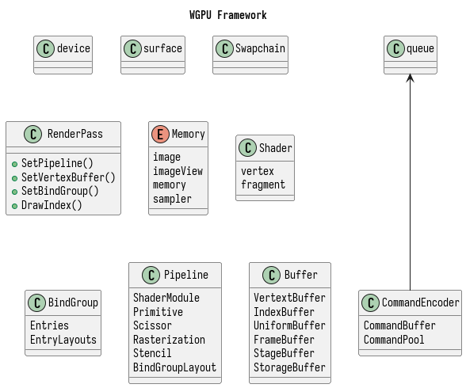

# A Simple C++ Gui Application Framework with wgpu



## How to use

```sh
$bash xrepo add -a -g private-repo https://github.com/linuxing3/xmake-repo.git
```

## clone this repo

```bash
$bash git clone https://github.com/linuxing3/efwmc-walnut-app.git
$bash cd efwmc-walnut-app
$bash xmake // will pull necesary packages from xmake repositories
```

## compile commands for header files (for clangd lsp)

```bash
$bash xmake project -k compile_commands && mv compile_commands build/
```

## Check installed package, `~/.xmake/packages/e/efwmcwalnut/v1.0.0/61df654bcb23488aa9c4fe4d3053ef07/include`

### include files

>

    3.3M ~/.xmake/packages/e/efwmcwalnut/v1.0.0/61df654bcb23488aa9c4fe4d3053ef07/include/Source
    3.2M █████████▋ ├──ImGui …
    45K ▏           ├──Walnut …
    38K ▏           ├──Application.cpp
    10K             ├──ResourceManager.cpp
    7873            ├──Application.h
    2582            ├──ResourceManager.h
    1425            ├──implementations.cpp
    649             ├──xmake.lua
    223             ├──Layer.h
      0             └──EntryPoint.h

>

### library files

>

    823K ~/.xmake/packages/e/efwmcwalnut/v1.0.0/61df654bcb23488aa9c4fe4d3053ef07/lib
    809K █████████▉ ├──libefwmcwalnut.a
    8192 ▏          └──pkgconfig …

>

## checkout the `xmake.lua` under `app`

```lua

--- @diagnostic disable:undefined-global

add_rules('mode.debug', 'mode.release')

add_requires('efwmcwalnut')
add_requires('glfw3webgpu')
add_requires('imgui-walnut walnut', { configs = { glfw = true, vulkan = true, wgpu =  true } })
add_requires('glfw-walnut walnut', { configs = { glfw_include = 'vulkan' } })

target('wgpuapp')
set_languages('c++20')
set_kind('binary')
add_files('**.cpp')
add_includedirs('.')
add_defines('RESOURCE_DIR="./wgpu"')
add_defines('WEBGPU_BACKEND_WGPU')
-- packges with link need
add_packages('efwmcwalnut')
add_packages('glfw3webgpu')
add_packages('glfw-walnut', 'imgui-walnut')
-- local packges with include and link need
add_includedirs('$(projectdir)/vendor/webgpu/include')
add_includedirs('$(projectdir)/vendor/webgpu/include/webgpu')
add_linkdirs('$(projectdir)/vendor/webgpu/bin/linux-x86_64')
add_links('wgpu')
after_build(function(target)
    os.cp('$(scriptdir)/resources/shaders/wgpu', target:targetdir())
end)
```

### `efwmcwalnut` package

```lua

--- @diagnostic disable:undefined-global

add_rules('mode.debug', 'mode.release')
add_requires('glfw3webgpu')
add_requires('imgui-walnut walnut', { configs = { glfw = true, vulkan = true, wgpu = true } })
add_requires('glfw-walnut walnut', { configs = { glfw_include = 'vulkan' } })
target('efwmcwalnut')
set_languages('c++20', 'c99')
set_kind('static')
add_files('**.cpp')
add_includedirs('.')
add_defines('RESOURCE_DIR="./wgpu"')
add_defines('WEBGPU_BACKEND_WGPU')
add_packages('glfw3webgpu', 'glfw-walnut', 'imgui-walnut')
-- packges without link need
add_packages('vulkan-headers', 'stb', 'tinyobjloader')
-- local packges with include and link need
add_includedirs('$(projectdir)/vendor/webgpu/include')
add_includedirs('$(projectdir)/vendor/webgpu/include/webgpu')
add_linkdirs('$(projectdir)/vendor/webgpu/bin/linux-x86_64')
add_links('wgpu')
```

### `glfw-walnut` package

```lua

add_rules('mode.debug', 'mode.release')

if is_os('windows') then
    target('glfw-walnut')
    set_languages('c++20')
    set_kind('static')
    add_defines('_GLFW_WIN32', '_CRT_SECURE_NO_WARNINGS')
    add_files(
        'src/context.c',
        'src/init.c',
        'src/input.c',
        'src/monitor.c',
        'src/null_init.c',
        'src/null_joystick.c',
        'src/null_monitor.c',
        'src/null_window.c',
        'src/win32_platform.c',
        'src/vulkan.c',
        'src/window.c'
    )
    add_files(
        'src/win32_init.c',
        'src/win32_joystick.c',
        'src/win32_module.c',
        'src/win32_monitor.c',
        'src/win32_time.c',
        'src/win32_thread.c',
        'src/win32_window.c',
        'src/wgl_context.c',
        'src/egl_context.c',
        'src/osmesa_context.c'
    )
    add_includedirs('include')
    add_links('gdi32', 'shell32')
else
    target('glfw-walnut')
    set_languages('c++20')
    set_kind('static')
    add_defines('_GLFW_X11')
    add_files(
        'src/context.c',
        'src/init.c',
        'src/input.c',
        'src/monitor.c',
        'src/null_init.c',
        'src/null_joystick.c',
        'src/null_monitor.c',
        'src/null_window.c',
        'src/vulkan.c',
        'src/platform.c',
        'src/window.c'
    )
    add_files(
        'src/x11_init.c',
        'src/x11_monitor.c',
        'src/x11_window.c',
        'src/x11_platform.c',
        'src/xkb_unicode.c',
        'src/posix_module.c',
        'src/posix_time.c',
        'src/posix_thread.c',
        'src/posix_module.c',
        'src/glx_context.c',
        'src/egl_context.c',
        'src/osmesa_context.c',
        'src/linux_joystick.c'
    )
    add_includedirs('include')
    add_links('libx11', 'libxrandr', 'libxrender', 'libxinerama', 'libxfixes', 'libxcursor', 'libxi', 'libxext')
    add_syslinks('dl', 'pthread')
    add_defines('_GLFW_X11')
end
```

### `imgui-walnut` package

```lua

add_rules('mode.debug', 'mode.release')
set_languages('cxx11')

target('imgui-walnut')
set_kind('$(kind)')
add_files('*.cpp', 'misc/cpp/*.cpp')
add_headerfiles('*.h', '(misc/cpp/*.h)')
add_includedirs('.', 'misc/cpp')

if has_config('glfw') then
    add_files('backends/imgui_impl_glfw.cpp')
    add_headerfiles('(backends/imgui_impl_glfw.h)')
    add_packages('glfw')
end


if has_config('vulkan') then
    add_files('backends/imgui_impl_vulkan.cpp')
    add_headerfiles('(backends/imgui_impl_vulkan.h)')
    add_packages('vulkansdk')
end

if has_config('wgpu') then
    add_files('backends/imgui_impl_wgpu.cpp')
    add_headerfiles('(backends/imgui_impl_wgpu.h)')
    add_packages('wgpu-native')
end

```

### `walnut` packages

```lua
--- @diagnostic disable:undefined-global
add_requires('imgui-walnut walnut', { configs = { glfw = true, vulkan = true } })
add_requires('glfw-walnut walnut', { configs = { glfw_include = 'vulkan' } })
add_requires('glm')
add_requires('stb')
add_requires('spdlog')
add_requires('vulkan-headers')

if is_os('windows') then
    target('Walnut')
    set_languages('c++20')
    set_kind('static')
    add_files('Source/**.cpp', 'Platform/GUI/**.cpp')
    add_includedirs('Source')
    add_includedirs('Platform')
    add_packages('imgui-walnut')
    add_packages('glfw')
    add_packages('glm')
    add_packages('stb')
    add_packages('spdlog')
    add_packages('vulkan-headers')
else
    target('walnut')
    set_languages('c++20')
    set_kind('static')
    add_files('Source/**.cpp', 'Platform/GUI/**.cpp')
    add_defines('GLFW_INCLUDE_NONE')
    add_defines('GLFW_INCLUDE_VULKAN')
    add_includedirs('Source')
    add_includedirs('Platform/GUI')
    add_packages('imgui-walnut')
    add_packages('glfw-walnut')
    add_packages('glm')
    add_packages('stb')
    add_packages('vulkan-headers')
    add_packages('spdlog')
    add_links('glfw-walnut')
end
```
